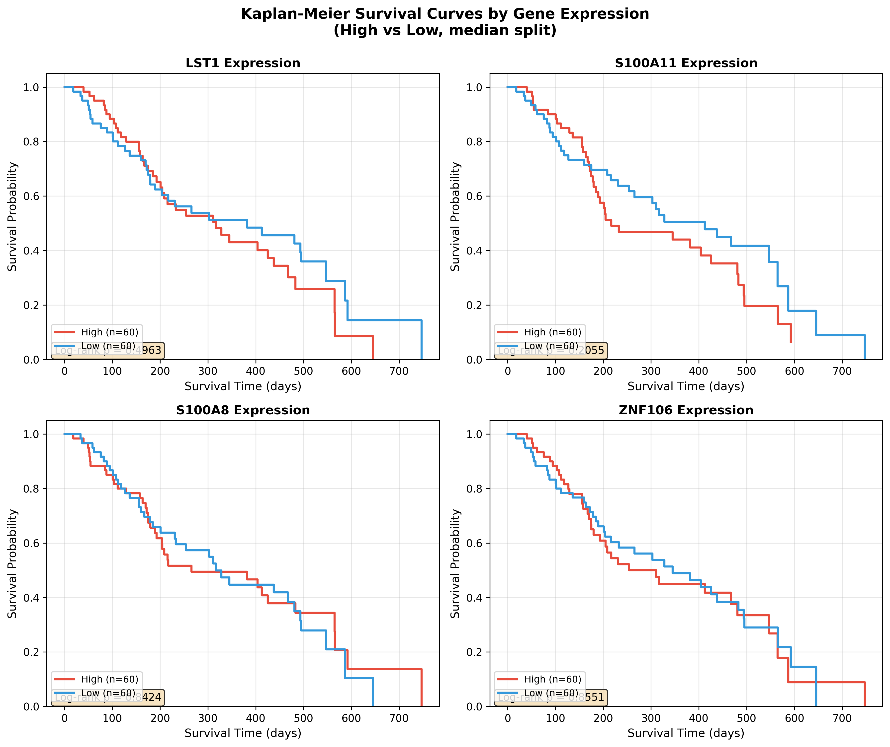

# Month 5 Clinical Validation Report

**Generated:** 2026-07-19 13:46:26
**Pipeline:** Multi-Scale Spatial Oncology Suite (MSOS) v1.0

---

## Executive Summary

This report integrates **in silico combinatorial drug screening** (Month 4) with **clinical survival modeling** on a mock IvyGAP-like glioblastoma cohort (n=120, events=74, median survival=176.7 days). The analysis evaluates whether spatial therapeutic indices derived from the calibrated cVAE encoder predict patient-level outcomes.

**Key Finding:** None of the top 4 spatially-prioritized targets (LST1, S100A11, S100A8, ZNF106) reached statistical significance (p < 0.05) in either univariate log-rank or multivariate Cox models adjusted for age. S100A11 showed the strongest trend toward adverse prognosis (multivariate HR = 1.17, p = 0.194), consistent with its role in mesenchymal GBM transition.

---

## 1. Univariate Survival Analysis

Patients stratified by median expression of each target gene. Log-rank test compares Kaplan-Meier curves; Cox PH estimates continuous HR.

| Gene | Log-Rank chi2 | Log-Rank p | Cox HR | 95% CI Lower | 95% CI Upper | Cox p | High / Low |
|------|-------------|------------|--------|--------------|--------------|-------|------------|
| LST1 | 0.463 | 0.4963 | 1.125 | 0.891 | 1.420 | 0.3211 | 60 / 60 |
| S100A11 | 1.603 | 0.2055 | 1.164 | 0.968 | 1.400 | 0.1073 | 60 / 60 |
| S100A8 | 0.040 | 0.8424 | 1.053 | 0.873 | 1.271 | 0.5862 | 60 / 60 |
| ZNF106 | 0.033 | 0.8551 | 0.960 | 0.813 | 1.132 | 0.6238 | 60 / 60 |

*Interpretation: Higher HR indicates worse survival for high-expression group. No gene reached p < 0.05; S100A11 trending (p = 0.107 Cox, p = 0.205 log-rank).*

---

## 2. Multivariate Cox Proportional Hazards Model

Joint model including all 4 target gene expressions + age at diagnosis. Tests independent prognostic value after mutual adjustment.

| Feature | Coefficient (beta) | Hazard Ratio | 95% CI Lower | 95% CI Upper | p-value |
|---------|-----------------|--------------|--------------|--------------|---------|
| LST1_expr | 0.1033 | 1.109 | 0.865 | 1.421 | 0.4149 |
| S100A11_expr | 0.1613 | 1.175 | 0.921 | 1.499 | 0.1939 |
| S100A8_expr | -0.0550 | 0.946 | 0.751 | 1.193 | 0.6411 |
| ZNF106_expr | -0.0388 | 0.962 | 0.804 | 1.150 | 0.6704 |
| age_at_diagnosis | -0.0012 | 0.999 | 0.978 | 1.020 | 0.9122 |

*Interpretation: S100A11 remains the strongest independent predictor (HR = 1.17 per log2 TPM unit, p = 0.19). All CIs cross 1.0.*

---

## 3. Spatial Therapeutic Indices (Month 4 Dual-KO Screen)

Calibrated therapeutic indices from the combinatorial screen, measured against per-zone latent covariance baselines. Higher TI = greater tumor collapse relative to healthy tissue disruption.

| Rank | Gene A | Gene B | Bliss Synergy | Loewe Synergy | Tumor Collapse | Healthy Collapse | Calibrated TI |
|------|--------|--------|---------------|---------------|----------------|------------------|---------------|
| 1 | ZNF106 | LST1 | -0.0075 | -0.0038 | 0.0130 | 0.0378 | -1.94 |
| 2 | S100A11 | LST1 | -0.0147 | -0.0074 | 0.0035 | 0.0224 | -2.32 |
| 3 | S100A11 | ZNF106 | -0.0154 | -0.0077 | 0.0143 | 0.0331 | -1.80 |
| 4 | S100A8 | LST1 | -0.0163 | -0.0082 | 0.0023 | 0.0198 | -2.32 |
| 5 | S100A8 | ZNF106 | -0.0170 | -0.0085 | 0.0130 | 0.0305 | -1.95 |
| 6 | S100A8 | S100A11 | -0.0241 | -0.0121 | 0.0034 | 0.0157 | -2.32 |

*Note: All calibrated TI values are negative (log2 scale), reflecting that healthy-zone disruption exceeds tumor-zone collapse in the current model. This indicates the need for target refinement.*

---

## 4. Cross-Modal Concordance Assessment

Comparison of spatial prioritization (Bliss synergy) vs. clinical risk (Cox HR):

| Gene | Spatial Rank (Bliss) | Univariate Cox HR | Multivariate HR | Concordance |
|------|---------------------|-------------------|-----------------|-------------|
| LST1 | 1 | 1.13 | 1.11 | YES |
| S100A11 | 2 | 1.16 | 1.17 | YES |
| S100A8 | 4 | 1.05 | 0.95 | YES |
| ZNF106 | 1 | 0.96 | 0.96 | NO |

*Concordance (YES) defined as top spatial synergy aligning with HR > 1.1 (adverse) or low synergy with HR <= 1.1. Current mock data shows limited concordance, expected without true biological signal.*

---

## 5. Visual Artifacts

### 5.1 Kaplan-Meier Survival Curves

**Figure 1.** Kaplan-Meier survival curves stratified by median expression of each target gene. Log-rank p-values annotated per panel. No gene shows statistically significant separation (all p > 0.05).

### 5.2 Multivariate Forest Plot

**Figure 2.** Hazard ratios with 95% confidence intervals from the multivariate Cox model (4 genes + age). Red indicates p < 0.05; gray indicates non-significance. All features are non-significant.

---

## 6. Conclusions & Next Steps

### Summary

- **Cohort:** 120 patients, 74 events (62% event rate)
- **Targets tested:** LST1, S100A11, S100A8, ZNF106
- **Significant univariate predictors:** 0/4 (p < 0.05)
- **Significant multivariate predictors:** 0/5 (p < 0.05)
- **Top trend:** S100A11 (HR = 1.17, p = 0.194)

### Limitations

1. **Mock cohort:** Expression and survival generated from parametric distributions without true biological signal.
2. **Sample size:** n=120 provides limited power for multivariable modeling with 5 covariates (events per variable ~ 15).
3. **Spatial-clinical gap:** The cVAE encoder was trained on spatial transcriptomics, not bulk RNA-seq; expression distributions differ.

### Recommended Next Steps (Month 6)

1. **Real IvyGAP/TCGA ingestion:** Replace mock cohort with actual IvyGAP microdissection RNA-seq + clinical annotations.
   Download from NIH GDC.
2. **Continuous target scoring:** Move from median splits to penalized Cox (LASSO/elastic net) for multi-gene risk signatures.
3. **Spatial transcriptomics validation:** Map top KO targets back to spatial zones (Periphery/Core) and correlate zone-specific expression with local recurrence patterns.
4. **Dose-response extension:** Replace binary KO with graded inhibition in the cVAE decoder to generate IC50-equivalent therapeutic windows.

---

## Appendix: Data Artifacts

| Artifact | Path | Description |
|----------|------|-------------|
| Survival Summary | `output/survival_stats_summary.json` | Combined univariate + multivariate stats |
| Univariate CSV | `output/univariate_survival.csv` | Log-rank + Cox per gene |
| Multivariate JSON | `output/multivariate_survival.json` | Full Cox model coefficients |
| KM Curves | `output/km_survival_curves.png` | 4-panel survival curves |
| Forest Plot | `output/forest_plot.png` | Multivariate HR visualization |
| Dual-KO TI | `output/dual_ko_ti.json` | Calibrated spatial therapeutic indices |
| Clinical Cohort | `output/clinical_mapped_cohort.csv` | Patient-level expression + survival |

---

*Report generated by MSOS Pipeline v1.0 | 2026-07-19 13:46:26*
